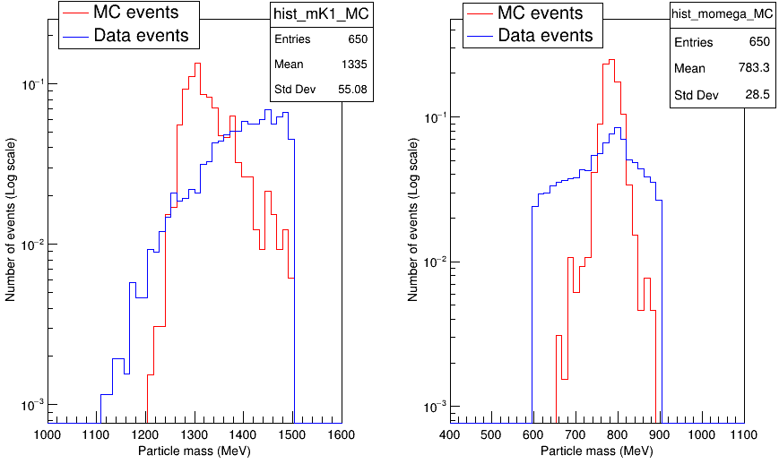

# Study of $B^{+} \to K_{1}^{+}\gamma$ at LHCb

![ROOT](https://img.shields.io/badge/ROOT-%236bc0dc?logo=data:image/png;base64,iVBORw0KGgoAAAANSUhEUgAAABgAAAAYCAYAAADgdz34AAAAGXRFWHRTb2Z0d2FyZQBBZG9iZSBJbWFnZVJlYWR5ccllPAAAA2RpVFh0WE1MOmNvbS5hZG9iZS54bXAAAAAAADw/eHBhY2tldCBiZWdpbj0i77u/IiBpZD0iVzVNME1wQ2VoaUh6cmVTek5UY3prYzlkIj8+IDx4OnhtcG1ldGEgeG1sbnM6eD0iYWRvYmU6bnM6bWV0YS8iIHg6eG1wdGs9IkFkb2JlIFhNUCBDb3JlIDUuMC1jMDYwIDYxLjEzNDc3NywgMjAxMC8wMi8xMi0xNzozMjowMCAgICAgICAgIj4gPHJkZjpSREYgeG1sbnM6cmRmPSJodHRwOi8vd3d3LnczLm9yZy8xOTk5LzAyLzIyLXJkZi1zeW50YXgtbnMjIj4gPHJkZjpEZXNjcmlwdGlvbiByZGY6YWJvdXQ9IiIgeG1sbnM6eG1wTU09Imh0dHA6Ly9ucy5hZG9iZS5jb20veGFwLzEuMC9tbS8iIHhtbG5zOnN0UmVmPSJodHRwOi8vbnMuYWRvYmUuY29tL3hhcC8xLjAvc1R5cGUvUmVzb3VyY2VSZWYjIiB4bWxuczp4bXA9Imh0dHA6Ly9ucy5hZG9iZS5jb20veGFwLzEuMC8iIHhtcE1NOk9yaWdpbmFsRG9jdW1lbnRJRD0ieG1wLmRpZDo5MUREM0ZCMTE3QTVFMzExODVDNDhENDcyNTVBNzdGNSIgeG1wTU06RG9jdW1lbnRJRD0ieG1wLmRpZDpCQzE5MUFBRkE1MjQxMUUzQTA4MTk2NkU0MDQyNzlGQSIgeG1wTU06SW5zdGFuY2VJRD0ieG1wLmlpZDpCQzE5MUFBRUE1MjQxMUUzQTA4MTk2NkU0MDQyNzlGQSIgeG1wOkNyZWF0b3JUb29sPSJBZG9iZSBQaG90b3Nob3AgQ1M1IFdpbmRvd3MiPiA8eG1wTU06RGVyaXZlZEZyb20gc3RSZWY6aW5zdGFuY2VJRD0ieG1wLmlpZDo5MkREM0ZCMTE3QTVFMzExODVDNDhENDcyNTVBNzdGNSIgc3RSZWY6ZG9jdW1lbnRJRD0ieG1wLmRpZDo5MUREM0ZCMTE3QTVFMzExODVDNDhENDcyNTVBNzdGNSIvPiA8L3JkZjpEZXNjcmlwdGlvbj4gPC9yZGY6UkRGPiA8L3g6eG1wbWV0YT4gPD94cGFja2V0IGVuZD0iciI/Pj5Q9FoAAAJsSURBVHjanFZdSBRRFD5zd/YnS7MN7WcpVkUEoYfoNRB8SbCHFMGeggh6DXrohzDoLRDRCHzOl3rspSgIIXroPQzZsFZf1M3ZndZddWd3ZvZ2znBnGX9m5o4HPu783Hu+O+ecOd9VOOcQYF2IUcQYIoPoEc9XEeuI94jPiIKvByI4AmnEHKLOw43mzIs1h3wd5XwIUeLRjdaMhBHcQ1j8mNbk3F6qNZ55fSqeHAwjPiESQUl5tFGGZcNs3cdAgcGUCr1JFU4yBkjCf9TMu9OZzgVvDih+WzK7vJrb5NN/K4Fzdu2miUMX+WZiI09ExQSaZjWhhBjA3QZZG1NownO6JoI04gFIWE6Epi+EQNh98k0Ek2FxbxHUTYgpAL0JKQLyOcFEcqWMknsxHoMUU2SXjBLBoOzsnGFBfzIOEeyKm4NQs7GaV+pEoEYhSDO/NwXThqdY87b4TfINC7D2oC8RicCpIv3gwwV9F4Z/b8Hbf3vwoVLbV0ERv0AngmX3Lo8hGFstwovCNtzoSEEWdztf3HHe/cJ3xyBYYth4vlLzeaVVYWKtCNdOJOB7/zmYzZyBh93tzs6/VA1nPI8V1B5jUQg+Ki8L21ksv5Xrp5Lq7c62fQ4o/jfzmlOWmmXDpbgK77JnZZ03EBecXvStaiz69ZXFSo1f/rnuYGqjHKW5vva267TV9NeAW3nNIXhT2pF1XnYFyI2Hji1gXHzWIXvc3eGMA3I/mY0Yb1XnAcGZ9JPJO2tFvtkI1SJLiFZ0yfxjmDKSOSSjyYTTiBnEnqToz/mJvhJybKE+NSKOLT0eUdLE0cU9tuh+Dv4LMAASgaKyrsoPnQAAAABJRU5ErkJggg==)  

## Theoretical Context

This internship focuses on the rare radiative decay $B^{+} \to K_{1}^{+}\gamma$, which is a flavor-changing neutral current (FCNC) process forbidden at tree level in the Standard Model. The decay proceeds via penguin diagrams at loop level through the $b \to s\gamma$ transition, where a bottom quark changes flavor to a strange quark while emitting an energetic photon. Due to the $V-A$ structure of weak interactions, Standard Model predictions favor left-handed photon polarization. Observing right-handed photons would signal new physics contributions.

The transition amplitude is proportional to the CKM matrix element $V_{ts}$, and the top quark dominates the loop due to its large mass. The reconstructed final state consists of $B^{+} \to K_{1}^{+}(K^{+}\omega[\pi^{+}\pi^{-}\pi^{0}])\gamma$, requiring identification of three charged tracks, one high-energy photon, and a $\pi^{0}$ decaying to two photons.

## The LHCb Detector and Data

LHCb is a forward single-arm spectrometer designed to study beauty and charm physics in the high $b\bar{b}$ production region at the LHC. The detector combines tracking systems (VELO, TT, T1-T3 stations) with a dipole magnet for momentum measurement, RICH detectors for particle identification, calorimeters for energy measurement, and a muon system.

Run 1 data (2011-2012) at $\sqrt{s} = 7\text{-}8$ TeV was used, corresponding to an integrated luminosity of approximately 3 fb$^{-1}$. Events were selected using radiative trigger lines requiring high transverse energy deposits in the calorimeters and high-$p_T$ tracks with large impact parameters.

## Analysis Methodology

### Helicity Angle Reconstruction

The helicity angle $\theta$ between the $B^{+}$ and $K^{+}$ in the $K_{1}^{+}$ rest frame provides sensitivity to photon polarization. Reconstruction proceeds by building four-momentum vectors for all final state particles, then boosting to the $K_{1}^{+}$ rest frame where momentum conservation gives $\vec{p}_{K^+} = -\vec{p}_{\omega}$ and $\vec{p}_{B^+} = \vec{p}_{\gamma}$.

The helicity angle is computed as:

$$\cos\theta_{\text{hel}} = \frac{\vec{p}_{B^+} \cdot \vec{p}_{K^+}}{|\vec{p}_{B^+}| \times |\vec{p}_{K^+}|}$$

Analysis of simulated events showed excellent resolution ($\sigma \sim 0.01$ in cosine) and revealed detector acceptance effects that distort the flat generated distribution.

### Preselection Development

Using Monte Carlo signal samples, I developed cuts on three categories of variables.

**Particle Identification:** Neural network outputs distinguish different particle types based on RICH detector information. The variables ProbNNpi, ProbNNk, and ProbNNp are bounded between 0 and 1, where higher values indicate stronger confidence that a track is a pion, kaon, or proton respectively. These neural networks analyze the Cherenkov ring patterns produced when charged particles traverse the RICH detectors, since particles with different masses produce rings of different sizes for the same momentum. For photons, gammaCL indicates the quality of electromagnetic shower reconstruction in the calorimeters, while isPhoton separates single photons from merged $\pi^{0}$ candidates based on the energy deposition profile.

**Topological Variables:** IPCHI2_OWNPV measures how consistent a track is with originating from the primary vertex (higher values indicate the particle likely comes from a secondary decay). For the $B^{+}$, FD_OWNPV measures flight distance, FDCHI2_OWNPV quantifies the significance of this separation between primary and decay vertices, DIRA_OWNPV checks alignment between the momentum vector and the flight direction, and ENDVERTEX_CHI2 assesses vertex reconstruction quality.

**Invariant Masses:** Reconstructed masses of intermediate resonances ($\omega$, $K_{1}^{+}$) and the $B^{+}$ candidate provide discrimination against combinatorial background.

The optimized cuts achieved 57% signal efficiency on truth-matched simulated events. This efficiency results from sequential application of different cut categories: charged particle identification retains 91% of signal (corresponding to about 97% efficiency per individual track), neutral particle identification keeps 81%, mass cuts retain essentially all signal (100%), and trigger requirements accept 76% of events. Multiplying these sequential efficiencies gives the overall 57% signal retention.

### Background Rejection

Examination of two-body and three-body invariant mass distributions in data revealed specific resonant backgrounds requiring vetoes:
- $K^{*0}(892) \to K^{+}\pi^{-}$ at 892 MeV
- $D^{0} \to K^{-}\pi^{+}$ and $D^{0} \to K^{-}\pi^{+}\pi^{0}$ at 1865 MeV

Excluding candidates with $m_{K^+\pi^-} \in [840, 970]$ MeV, $m_{K^+\pi^-} \in [1750, 1970]$ MeV, or $m_{K^+\pi^-\pi^0} \in [1750, 1970]$ MeV removes these specific backgrounds. Applied to signal Monte Carlo, these vetoes retain 85% of events (meaning only 15% of true signal happens to fall into these mass windows by chance). On data, these vetoes reduced the sample by a factor of 1.6, indicating these resonances contributed significantly to the initial candidate pool.

## Results on Run 1 Data

Starting from inclusive samples combining a high-energy photon with three tracks and a $\pi^{0}$, initial mass window cuts reduced the dataset by a factor of about 30. The full preselection then further reduced this to approximately 100,000 candidates passing all trigger and particle identification requirements. Tightening the mass cuts on $\omega$ (600-900 MeV) and $K_{1}^{+}$ (below 1500 MeV) brought the final sample down to roughly 2,600 candidates.

<div align="center">

</div>

**Figure:** Reconstructed invariant mass distributions for the $K_{1}^{+}$ (left) and $\omega$ (right) candidates. Red histograms show signal MC events, blue histograms show Run 1 data after preselection. The distributions are normalized to unity area for comparison.

The $\omega$ meson appeared as a clear peak at 783 MeV in the $\pi^{+}\pi^{-}\pi^{0}$ invariant mass distribution, demonstrating successful reconstruction of this intermediate state and validating the analysis approach. However, no clear $K_{1}^{+}$ signal emerged in the $K^{+}\omega$ invariant mass spectrum, where the data distribution remains relatively flat compared to the peaked MC signal expectation around 1335 MeV.

An exploratory fit to the $B^{+}$ mass distribution used a Gaussian for signal ($\mu = 5294$ MeV, $\sigma = 106$ MeV fixed from MC) plus an exponential and flat component for background. While a small excess appeared near the $B^{+}$ mass around 5280 MeV, the poor fit quality ($\chi^2/\text{ndf} = 47/24$) and absence of $K_{1}^{+}$ signal suggest either insufficient statistics or additional background components not yet modeled. Proper treatment would require ARGUS-type functions for partially reconstructed decays.

## Code Implementation

The analysis was performed in ROOT's C++ framework. A typical preselection loop structure:
```cpp
TFile* file = TFile::Open("data.root");
TTree* tree = (TTree*)file->Get("DecayTree");

// Branch addresses
Double_t B_M, Kplus_ProbNNk, gamma_CL;
tree->SetBranchAddress("B_M", &B_M);
tree->SetBranchAddress("Kplus_ProbNNk", &Kplus_ProbNNk);
tree->SetBranchAddress("gamma_CL", &gamma_CL);

// Preselection loop
for(Long64_t i = 0; i < tree->GetEntries(); i++) {
    tree->GetEntry(i);
    
    if(Kplus_ProbNNk < 0.2) continue;
    if(gamma_CL < 0.2) continue;
    if(B_M < 4500 || B_M > 7000) continue;
    
    // Event passes preselection
    h_B_M->Fill(B_M);
}
```

Helicity reconstruction used TLorentzVector objects for Lorentz transformations:
```cpp
TLorentzVector pB, pK1, pKplus, pGamma;
// ... set four-momenta from tree branches ...

TVector3 boostK1 = pK1.BoostVector();
pB.Boost(-boostK1);
pKplus.Boost(-boostK1);

Double_t cosHelicity = pB.Vect().Dot(pKplus.Vect()) / 
                       (pB.Vect().Mag() * pKplus.Vect().Mag());
```

The BackgroundCategory tool classified reconstructed candidates by matching decay products to true MC particles, separating fully matched signal (BKGCAT = 10) from combinatorial background.

## Outlook

This work establishes the framework for $B^{+} \to K_{1}^{+}\gamma$ analysis at LHCb. Future improvements may include incorporating Run 2 data (expecting a 3-4× statistics increase), implementing multivariate analysis for better signal/background separation, modeling specific resonant backgrounds with dedicated MC samples, and extracting photon polarization from the helicity angle distribution once sufficient signal is observed.
